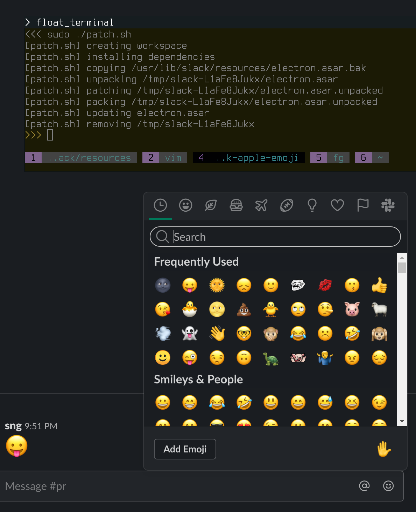

# slack-apple-emoji-linux
Bringing the awesome Apple Emoji 👻😈🤓 back to Slack on Linux



## Installation
```sh
$ sudo ./patch-slack.sh
```

## Uninstallation
```sh
$ sudo mv \
  /usr/lib/slack/resources/electron.asar.bak \
  /usr/lib/slack/resources/electron.asar
```
